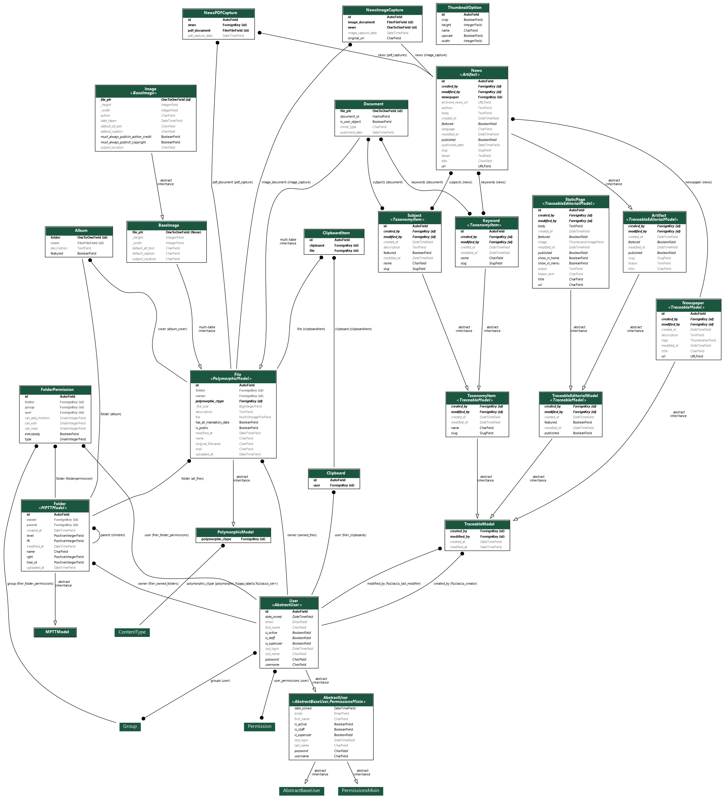

# Backend do site xRAM-Memory

Este projeto concentra o sistema gestor de conteúdo e a API para o site do xRAM-Memory. O projeto utilizou várias bibliotecas em Python, especialmente: Django (Framework base e CMS), Django REST Framework (API), newspaper3k e goose3 (crawlers de notícia), django-filer (Gestão de arquivos) e celery (Gestão de filas para processamento distribuído).

As dependências do projeto são geridas com a ferramenta `pipenv`.

## Instalação

0) Instale o [Python 3.7.2+](https://www.python.org/downloads/) e o [Pipenv](https://pypi.org/project/pipenv/)
1) Instale os pacotes: `python3-pdfkit`, `poppler-utils` e `wkhtmltopdf`
3) Instale as dependências do projeto: `pipenv install --dev` e `npm install`
4) Defina as variáveis ambiente em `.env` a partir de `.env.example`
5) Entre no shell do pipenv: `pipenv shell`
6) Instale os corpos do nltk: `./scripts/download_corpora.py --user`
7) Colecione os estáticos: `./manage.py collectstatic`
8) Execute as migrações: `./manage.py migrate`
9) Crie um super-usuário: `./manage.py createsuperuser`


## Execução local
### Aplicação
0) Execute os passos de instalação
1) Entre num shell `pipenv`
3) Suba um container memcached: `docker run --name my-memcache -d -p 127.0.0.1:11211:11211 memcached memcached -m 64`
3) Suba a aplicação localmente: `./manage.py runserver_plus`
4) Vá até `http://localhost:8000/admin/`
5) Rode o projeto `micro-lunr_index_builder` e faça um symlink entre o arquivo de índice gerado por ele e o arquivo
servido por este projeto, de forma que o frontend possa requisitar este arquivo. Na pasta do projeto
`micro-lunr_index_builder` execute:
```shell
ln -s arquivo_json_na_pasta_de_micro_index_builder /pasta/de/django-xram_memory/media/lunr_index/index.json
```


### Celery
0) Suba um container do redis escutando na porta padrão localmente:
```shell
docker run --name some-redis -d -p 127.0.0.1:6379:6379 redis
```
1) Suba quantas instâncias do celery julgar necessário. Num shell `pipenv`, execute:
```shell
celery worker -A xram_memory -n 1
```
3) (Opcional) Monitore os workers com o *Flower*. Num shell `pipenv`, execute:
```shell
flower -A xram_memory
```


## Entidades de dados

Os seguintes modelos (entidades) estão presentes neste projeto:

O diagrama abaixo ilustra a relação entre as entidades (clique para abrir a imagem):

[](./docs/entidades.png)

## Estrutura do projeto

Um projeto em Django é constituído de vários aplicativos, cada um com uma responsabilidade específica, o que pode ser expresso pela organização das pastas. Esta é a estrutura da pasta `./xram_memory`, que contém o código-fonte do sistema:

```
.
├── albums - Aplicativo para gestão de álbuns
├── artifact - Aplicativo para gestão de Artefatos
├── lib - Bibliotecas especializadas desenvolvidas para o projeto
│   ├── file_previews - Gerador de visualizações de arquivo
│   ├── news_fetcher - Programa principal do sistema, mais sobre ele abaixo
│   │   └── plugins - As diversas implementações de plugins
│   │       ├── archives - Arquivadores de Notícias
│   │       ├── parsers - Extratores de conteúdo de Notícias
│   │       └── pdf_captures - Geradores de capturas de notícia em PDF
│   └── stopwords - Um dicionário de stopwords em vários idiomas
├── logger - Aplicativo responsável por logar operações do sistema
├── lunr_index - Aplicativo responsável pela geração de índices de pesquisa client-side
├── page - Aplicativo para a gestão de Páginas Estáticas
├── quill_widget - Aplicativo que provê um widget para edição em texto rico com a biblioteca Quill.js
├── search_indexes - Aplicativo responsável pela geração de índices de pesquisa server-side (ElasticSearch)
├── static - Arquivos estáticos
├── taxonomy - Aplicativo responsável pela classificação do conteúdo (Taxonomia)
├── templates - Alterações globais em templates
├── users - Aplicativo responsável pela gestão de usuários e grupos
└── utils - Utilitários globais
```

Na pasta `./tests` temos os testes do projeto. Atualmente a cobertura do código está em 65%.